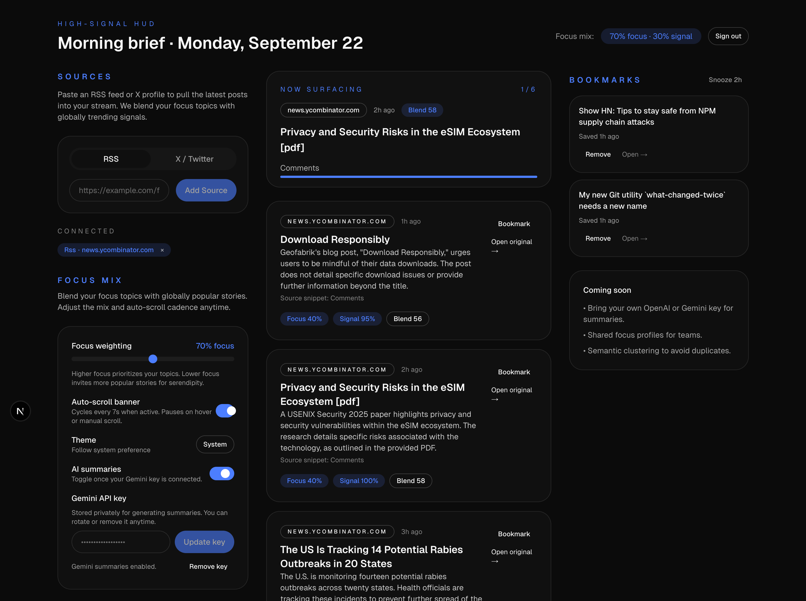

# High-Signal News HUD

An AI‑powered HUD for tracking the latest tech news. Users can add RSS feeds or X (formerly Twitter) profiles of selected tech figures and receive real‑time updates.

## App UI

<!-- markdownlint-disable-next-line MD033 -->


## Quick Start

1. Create `.env.local` with Supabase credentials:

```bash
NEXT_PUBLIC_SUPABASE_URL=your_supabase_database_url
NEXT_PUBLIC_SUPABASE_PUBLISHABLE_KEY=your_supabase_publishable_key
NEXT_PUBLIC_SUPABASE_ANON_KEY=your_supabase_anon_key
SUPABASE_SERVICE_ROLE_KEY=your_supabase_service_role_key
SUPABASE_PROJECT_REF=your_supabase_project reference
NEXT_PUBLIC_DEFAULT_RSS=a_link_to_rss
NEXT_PUBLIC_DEFAULT_TWITTER_HANDLE=@your_profile_name
```

1. Install dependencies and start the dev server:

```bash
npm install
npm run dev
```

App runs at [http://localhost:3000](http://localhost:3000)

## API Routes

- `POST /api/sources` — validate + insert RSS/X source, enqueue job, trigger ingestion
- `DELETE /api/sources/:id` — remove user-owned source
- `GET /api/feed` — return ranked items for user sources (cursor + blend scores)
- `GET/POST /api/preferences` — fetch/update focus weights, scroll speed, theme
- `GET/POST /api/bookmarks` & `DELETE /api/bookmarks/:itemId` — sync saved stories

Associated Edge Functions (Supabase)

- `rss-fetch` — fetches/parses RSS, dedupes, classifies topics, logs jobs
- `twitter-fetch` — placeholder worker for X ingestion (hooks are ready)

## Tech Stack

- Next.js 15 (App Router) • React 19 • TypeScript
- Styling: Tailwind CSS v4 + minimal custom tokens
- State: Zustand (session, feed, prefs, bookmarks slices)
- Backend: Supabase (Auth, Postgres with RLS, cron-ready jobs table)
- Edge Functions: Supabase Functions for ingestion & future expansion
- MCP: Supabase MCP server for migrations, deployments, automation

## Package Scripts

- `npm run dev` — Start Turbopack dev server
- `npm run build` — Production build (Turbopack)
- `npm run start` — Serve production build
- `npm run lint` — Run ESLint

## Directory Layout

- `src/app` — App Router routes (`/`, `/auth`, `/hud`, API handlers)
- `src/components` — HUD modules, reusable UI primitives
- `src/lib` — Supabase clients, utilities
- `src/store` — Zustand slices
- `supabase/functions` — Edge Functions (RSS + Twitter stubs)

Deploy to Vercel (or any Next.js host) and mirror Supabase env vars. Jobs & Edge Functions ship via Supabase CLI / MCP. A GitHub Actions or cron driver should ping `rss-fetch` periodically until pg_cron is enabled.
